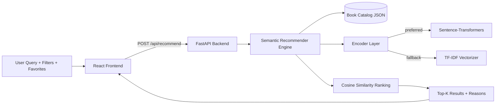

# Semantic Book Recommender

A production-style full-stack ML project that recommends books based on intent, not just keywords.

Users type natural language like "uplifting sci-fi with clever science," optionally select books they already like, and receive ranked recommendations with interpretable reasons.

## Why this project stands out

- **Semantic retrieval pipeline** with automatic model fallback:
  - `sentence-transformers` (`all-MiniLM-L6-v2`) for dense embeddings
  - TF-IDF fallback for lightweight environments
- **Personalization layer** that blends query intent with favorite-book anchors
- **Full-stack implementation** (`FastAPI` + `React/TypeScript`)
- **Explainable recommendations** with similarity score and reason strings
- **Portfolio-ready engineering**: typed APIs, tests, clean UI, and clear docs

## Product walkthrough

### What the user does

1. Enter a natural-language reading intent.
2. Add optional filters (genre, year).
3. Select favorite anchor books for personalization.
4. Review ranked results with score + explanation.

### What the system does

1. Converts each book (title, author, genres, description) into a semantic document.
2. Builds embeddings (transformer) or vectorized features (TF-IDF fallback).
3. Encodes the user query and blends with favorites centroid.
4. Ranks catalog items via cosine similarity.
5. Returns top-k recommendations and explanation metadata.

## Architecture Diagram



## Tech stack

- **Frontend:** React, TypeScript, Vite
- **Backend:** FastAPI, Pydantic
- **ML/NLP:** sentence-transformers (optional), scikit-learn, NumPy
- **Testing:** Pytest, FastAPI TestClient

## Repository structure

- `backend/app/main.py` - API routes and app setup
- `backend/app/recommender.py` - retrieval and ranking logic
- `backend/app/models.py` - typed contracts
- `backend/app/data/books_seed.json` - seed catalog (30 books)
- `backend/tests/test_api.py` - backend API tests
- `frontend/src/App.tsx` - main product UI
- `frontend/src/api.ts` - API client

## Local development

### 1) Start backend

```bash
cd backend
python3 -m venv .venv
source .venv/bin/activate
pip install -r requirements.txt
uvicorn app.main:app --reload --port 8000
```

Install stronger semantic model (optional):

```bash
pip install -r requirements-ml.txt
```

### 2) Start frontend

In a second terminal:

```bash
cd frontend
npm install
npm run dev
```

Frontend reads `VITE_API_BASE` (defaults to `http://localhost:8000`).

Use `frontend/.env` if needed:

```bash
VITE_API_BASE=http://localhost:8000
```

## API endpoints

- `GET /health` - service health + active model
- `GET /api/books` - returns full catalog
- `POST /api/recommend` - returns ranked recommendations

Example request:

```json
{
  "query": "space survival with scientific realism",
  "favorite_book_ids": ["book-005"],
  "top_k": 8,
  "genre_filter": "Science Fiction",
  "year_from": 2000
}
```

## Next iterations

- Replace JSON seed with PostgreSQL + `pgvector`
- Add user accounts and saved recommendation history
- Add offline eval metrics (MRR, NDCG) and experiment tracking
- Add Docker + cloud deployment pipeline (Render/Railway/Vercel)
